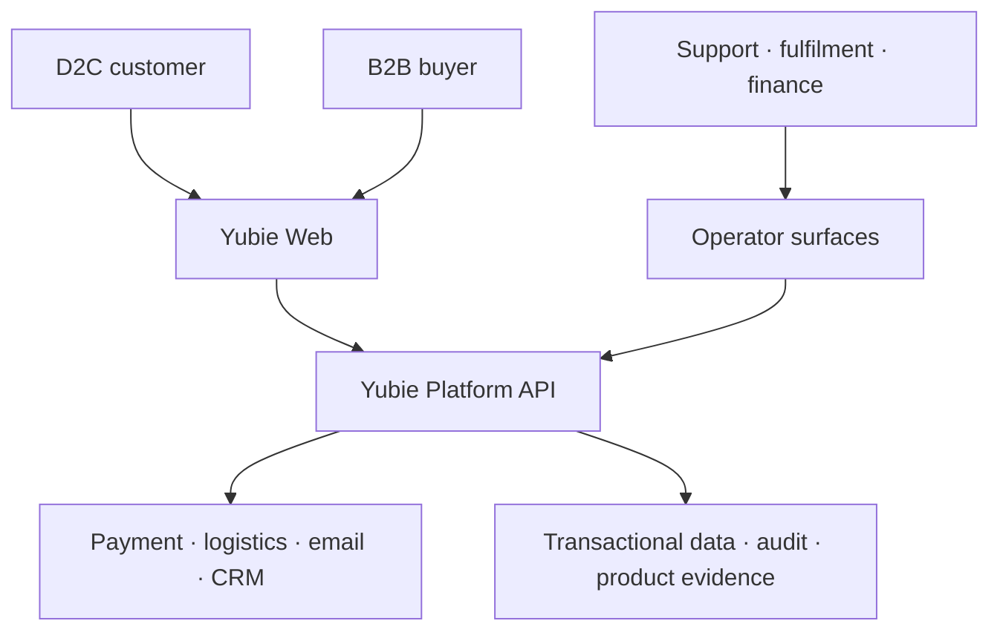
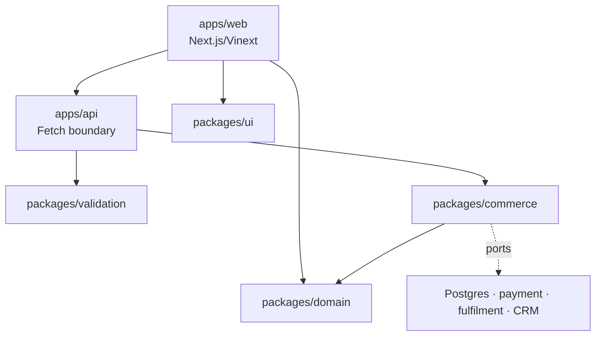
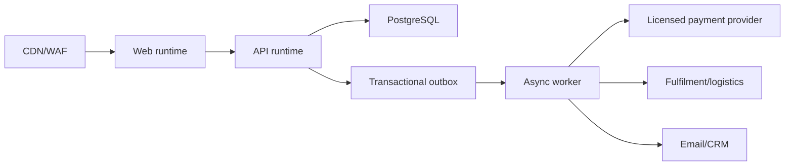
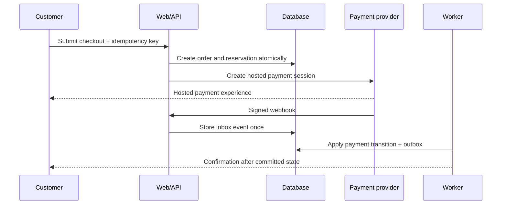

# Yubie Platform Architecture

**Decision:** begin as a modular monolith with clear domain boundaries, a separately deployable customer web app, and provider adapters. Extract services only when scale, reliability isolation, or team ownership produces measured pressure.

## 1. System context

## 2. Repository/container view

| Boundary | Owns | Must not own |
|---|---|---|
| `apps/web` | navigation, content presentation, interaction, server rendering | payment truth, inventory truth, claim approval |
| `apps/api` | HTTP semantics, authentication boundary, orchestration entrypoints | provider-specific business rules |
| `packages/domain` | product, variant, claim, order, payment, inventory, lot, fulfilment language and invariants | React, HTTP, SQL clients |
| `packages/validation` | external request/response schemas | authorization or business state |
| `packages/commerce` | application use cases and provider ports | direct UI state |
| `packages/ui` | design tokens and accessible primitives | product truth or API access |
| `packages/config` | strict shared tooling settings | runtime secrets |

## 3. Production target

### Source-of-truth rules

- PostgreSQL owns orders, payment observations, reservations, inventory movements, lots, fulfilment state, consents, evidence metadata, and audit history.
- Payment providers own external payment settlement; Yubie stores verified observations and reconciles them.
- Fulfilment/logistics providers own carrier execution; Yubie stores normalized shipment events.
- The CMS may own editorial composition but cannot publish protected product facts without the product-truth approval boundary.
- Analytics is never the source of truth for orders, money, consent, inventory, or food traceability.

## 4. Core transaction flow

The browser redirect is not payment proof. Only a verified, replay-safe provider event or reconciliation result may transition an order to paid.

## 5. Food-tech extensions

Physical-food commerce adds invariants ordinary digital storefronts do not have:

- each sellable inventory unit maps to a released lot and expiry/best-before policy;
- quarantined, recalled, expired, or unapproved lots cannot be reserved;
- fulfilment allocates FEFO unless a documented exception applies;
- ingredient/formula/label changes create a new product specification version;
- every public claim resolves to evidence and approval effective for that specification version;
- customer complaints can be correlated to SKU, lot, order, supplier, and production record;
- recall scope can identify affected stock, shipments, customers, and communication status.

## 6. Security and trust boundaries

- Internet input terminates at CDN/WAF and remains untrusted through validation.
- Authentication establishes identity; authorization is checked at every protected operation.
- Webhook endpoints require provider-specific signature verification, timestamp tolerance, replay protection, and inbox deduplication.
- Card details remain on the payment provider's hosted components; Yubie stores provider references, not primary account numbers or CVV.
- Operator access uses least privilege, MFA, auditable actions, and separated production roles.
- Secrets enter through managed runtime secret stores and are rotated without code changes.

## 7. Reliability model

Synchronous request paths are short: validate, authorize, commit canonical state, return. Slow or failure-prone integrations run asynchronously through outbox/worker delivery. Retries are bounded and idempotent; poison events enter a dead-letter workflow with owner and runbook.

Target SLOs, telemetry, backup/restore, deployment strategy, and incident response are defined in [`production/`](./production/README.md).
