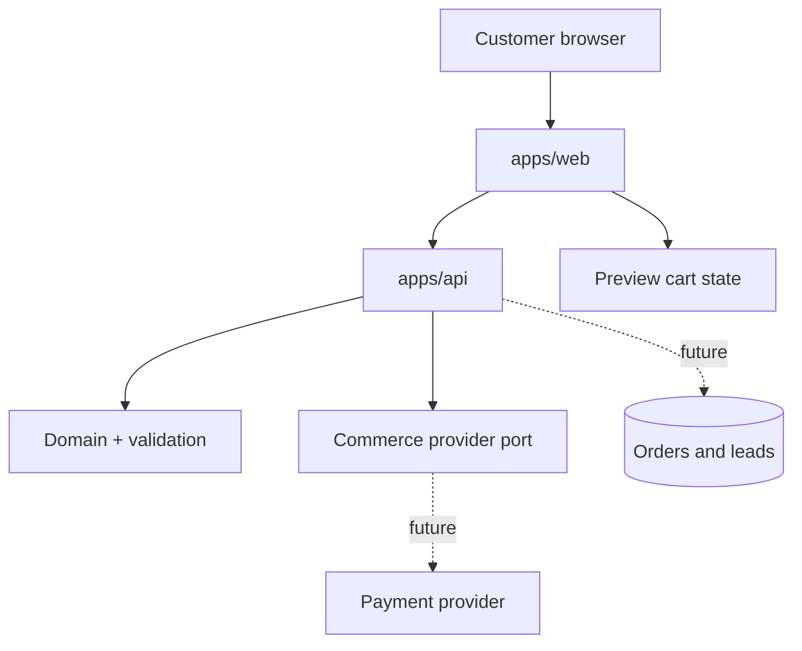

# Architecture

## System boundary

The current release is intentionally safe for brand validation: catalog browsing and local cart interactions work, forms are validated, and the checkout boundary returns a non-payable preview session. No UI path can accidentally charge a customer.

## Layer ownership

| Layer | Owns | Must not own |
| --- | --- | --- |
| Web | Content, UX, cart presentation, SEO | Payment secrets, provider SDK objects |
| API | HTTP contracts, orchestration, abuse controls | Brand layouts, browser-only state |
| Domain | Stable business language | Framework or transport types |
| Validation | Untrusted-input parsing | Persistence or side effects |
| Commerce | Provider contract and adapters | Product marketing claims |
| UI | Shared tokens and primitives | Product availability |

## Data strategy

The present implementation keeps the cart on the customer device and does not persist leads. Production rollout should add a regional data store with explicit retention windows, encrypted secrets, idempotent checkout creation, verified payment webhooks, and auditable order-state transitions.

## Performance posture

- Product photography is pre-compressed WebP and served with responsive sizing hints.
- The first viewport uses one prioritized hero asset; secondary media remains route-scoped.
- Server-rendered routes keep product discovery indexable and resilient without client JavaScript.
- Workspace packages contain no runtime framework duplication.
