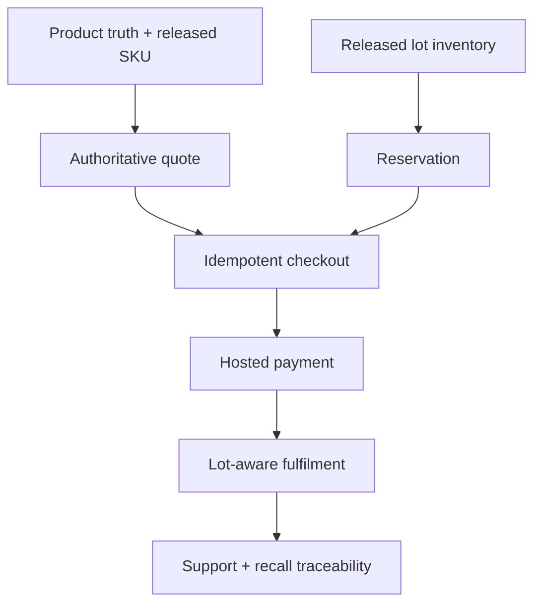

# 01 — Feature and System Catalog

## 1. Release classes

- **Launch-critical:** required for the first controlled commercial transaction.
- **Operational-critical:** required before limited public traffic.
- **Growth:** implemented after stable operations and measurable demand.
- **Deferred:** explicitly excluded from the current platform path.

## 2. Customer experience capabilities

| Capability | Current | Release class | Owning module | Acceptance outcome |
|---|---|---|---|---|
| Brand/home experience | implemented | launch-critical | web/content | Fast, accessible first viewport with verified messaging. |
| Product catalog and availability filter | partial | launch-critical | catalog/web | Only published variants and honest availability appear. |
| Product detail | implemented | launch-critical | catalog/web | Variant, price and approved facts come from one projection. |
| Search and shareable filters | planned | operational-critical | discovery/web | Query state is URL-addressable, keyboard accessible and index-safe. |
| Recipes and education | implemented prototype | operational-critical | content/web | Editorial content cannot override protected product truth. |
| Cart | implemented locally | launch-critical | cart/web | Device cart persists; server quote supersedes stale price/stock. |
| Checkout | prototype | launch-critical | checkout/order | Idempotent order and reservation are durable before payment redirect. |
| Hosted payment | planned | launch-critical | payment | Raw card details never enter Yubie; verified event controls payment state. |
| Order confirmation/status | planned | launch-critical | orders/comms | Customer receives stable reference and server-owned timeline. |
| Cancellation/refund request | planned | operational-critical | orders/payment/support | Policy is explicit; every action is idempotent and auditable. |
| Newsletter/community | prototype | operational-critical | consent/comms | Subscription and preference changes are durable and provable. |
| Product waitlist | planned | launch-critical for coming-soon | waitlist/catalog | Demand is captured per product without implying sale or launch date. |
| FAQ/legal/privacy | implemented | launch-critical | content/legal | Versioned policy content is reachable from relevant forms/flows. |
| Account | deferred | growth | identity/customer | Added only when repeat-purchase/support evidence justifies it. |

## 3. B2B capabilities

| Capability | Current | Release class | Acceptance outcome |
|---|---|---|---|
| Enquiry form | prototype | launch-critical | Durable lead, consent, source and deduplication. |
| Qualification and assignment | planned | operational-critical | Every qualified lead has owner, stage, next action and SLA. |
| Sample request approval | planned | operational-critical | Approval separates marketing request from physical distribution. |
| Sample shipment/traceability | planned | operational-critical | Recipient, SKU, specification and released lot are traceable. |
| CRM synchronization | planned | growth | At-least-once delivery with local source record and retry visibility. |
| Wholesale pricing/order | deferred | growth | Separate authorization, price list and credit/fulfilment policy. |

## 4. Operator capabilities

| Surface | Primary users | Minimum actions before public launch |
|---|---|---|
| Support | support lead | Search order/contact, view timeline, classify complaint, request refund/escalation. |
| Fulfilment | warehouse/3PL operator | View paid queue, allocate FEFO lot, pack, ship and record exceptions. |
| Inventory/food safety | QA/food-safety owner | Receive lot, release/quarantine, expire/recall and run traceability query. |
| Product truth | product/regulatory owner | Manage specification, evidence, claims, artwork scope and publish approval. |
| Finance | finance owner | Reconcile payment/refund/settlement and own exceptions. |
| B2B | sales/partnerships | Qualify lead, assign owner, record activity, approve and trace sample. |
| Privacy/security | privacy/security owner | Consent history, data requests, access audit and incident evidence. |

## 5. Platform systems

| System | Responsibility | Source of truth | Failure posture |
|---|---|---|---|
| Catalog/product truth | Specifications, variants, claims and public projection | PostgreSQL + private evidence store | Last approved projection remains; unapproved change is suppressed. |
| Pricing | Active price list and adjustment rules | PostgreSQL | Checkout fails closed if authoritative quote unavailable. |
| Order | Order lifecycle and immutable line snapshots | PostgreSQL | Retry returns prior idempotent outcome. |
| Payment | Provider observations, attempts, refunds and reconciliation | Provider settlement + Yubie verified record | No paid transition from redirect or unverified event. |
| Inventory/lot | Movements, balances, release and reservations | PostgreSQL ledger | Uncertain stock is unavailable, not guessed. |
| Fulfilment | Packages, lots, shipment and exceptions | Yubie normalized events + provider execution | Order remains actionable in exception queue. |
| Consent/communications | Purpose-scoped consent and delivery jobs | PostgreSQL | Operational transaction remains valid if message delivery fails. |
| Waitlist | Product interest, lifecycle and suppression | PostgreSQL | Duplicate capture is idempotent; consent is never inferred. |
| B2B/CRM | Lead, activity, sample and sync status | PostgreSQL; CRM is a projection unless ADR changes it | Provider outage queues retry; lead is not lost. |
| Audit | Security/business action history | Append-oriented PostgreSQL records | Critical mutation fails if required audit cannot commit. |
| Analytics | Behavioral event stream and derived dashboards | Warehouse/analytics tool | Never controls order, money, consent or inventory truth. |
| Observability | Runtime traces, metrics, logs and alerts | Telemetry platform | Redaction and sampling cannot remove critical business counters. |

## 6. Feature dependency graph

No launch-critical dependency is bypassed by UI copy, a feature flag or an operator spreadsheet.
