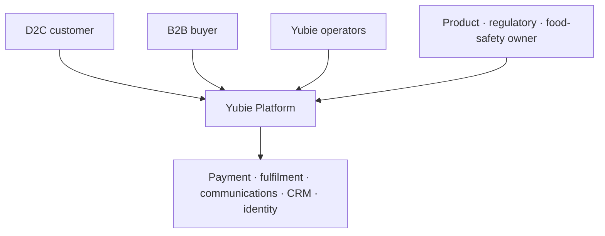

# 02 — C4 Level 1: System Context

## Scope

The software system in scope is **Yubie Platform**: customer experience, B2B demand capture, commerce orchestration, food-product truth, lot-aware operations and operator workflows. Payment, carriers, email, CRM and identity providers remain external systems even when deeply integrated.

## People and goals

| Person/role | Goal | Trust and access notes |
|---|---|---|
| D2C customer | Discover truthful products, join waitlist, purchase, receive and get support | Anonymous or optional customer identity; never trusted for price/payment state. |
| B2B buyer | Evaluate products, request samples and progress a commercial relationship | Business/contact information is confidential; sample distribution is lot-traceable. |
| Support operator | Explain orders and resolve permitted requests | Least privilege; cannot alter payment settlement or release quarantined stock. |
| Fulfilment operator/3PL | Allocate, pack and ship released inventory | Actions are scoped to location/order and audited. |
| Finance operator | Reconcile payment, refunds and settlements | Cannot edit provider truth; records resolution and compensating action. |
| Product/regulatory owner | Approve specifications, evidence, claims and artwork | Separate from marketing publication; expiry/effective date enforced. |
| Food-safety owner | Release/quarantine/recall lots and handle safety complaints | High-risk actions require reason and complete audit. |
| B2B owner | Qualify leads and manage samples | Marketing contact respects purpose and consent. |
| Engineer/on-call | Operate runtime and resolve incidents | No routine business mutation through database access. |

## External software systems

| External system | Data exchanged | Yubie contract |
|---|---|---|
| Hosted payment provider | Session, status, transaction/refund references, signed events, settlement report | Authorized provider; idempotent requests; signature verification; reconciliation and export. |
| Fulfilment/carrier | Shipment request, label/tracking, normalized events and exceptions | Timeout/retry policy; webhook/poll reconciliation; lot remains owned by Yubie. |
| Transactional email | Recipient, template/version, permitted variables, delivery events | No raw domain/provider payload; suppression and delivery audit. |
| Marketing platform | Purpose-scoped contact and preferences | Consent is evaluated by Yubie; unsubscribe flows back to ledger. |
| CRM | Lead/sample projection, owner/stage/activity | Local durable capture before sync; conflict/source ownership documented. |
| Identity provider | Operator authentication, MFA and role/group claims | Yubie authorizes every action; provider authentication alone is insufficient. |
| Analytics platform | Allowlisted pseudonymous events | Optional collection obeys consent; never receives protected free text. |
| Object storage | Evidence/artwork/document objects | Private, encrypted, checksummed, access-audited and malware-scanned where uploads exist. |

## Context invariants

1. External availability never determines whether Yubie's canonical transaction is committed.
2. Provider callbacks are untrusted until verified, deduplicated and mapped through an adapter.
3. Product evidence is not public content; only approved projections reach customer surfaces.
4. Operators use product workflows, not production database consoles, for normal operations.
5. Yubie remains able to export/reconcile critical provider data and execute a vendor exit plan.

## Key system journeys

- Discover product → select available variant → cart → quote → checkout → hosted payment → verified order → lot-aware fulfilment → support-visible delivery.
- View coming-soon product → submit product-specific waitlist consent → confirm preference → launch notification → unsubscribe/suppress.
- Submit B2B enquiry → qualify → approve sample → allocate released lot → ship → evaluate → opportunity outcome.
- Approve specification/evidence → approve claims/artwork → publish projection → supersede/expire safely.
- Detect lot/complaint issue → quarantine/recall → query affected inventory/orders/samples → communicate and record completion.
