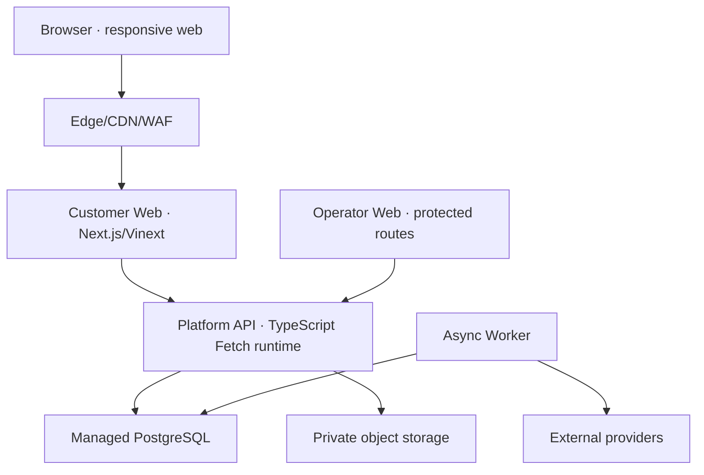

# 03 — C4 Level 2: Container View

## Target container topology



## Containers

| Container | Runtime/technology | Responsibility | Data owned |
|---|---|---|---|
| Edge | managed CDN/WAF/rate limit | TLS, caching, request protection, static delivery | No canonical business data. |
| Customer Web | Next.js 16 + React 19, Vinext/Cloudflare-compatible build | SSR/RSC pages, interaction islands, form/cart UX, public projections, route adapters | Device preferences and non-authoritative cart only. |
| Operator Web | Initially protected routes in `apps/web`; extraction only after pressure | Support, fulfilment, finance, truth, B2B and safety workflows | No independent truth; reads/writes through API. |
| Platform API | Fetch-compatible TypeScript modular monolith | Transport, auth boundary, application use cases, domain orchestration | Commits canonical state through repositories. |
| Async Worker | TypeScript worker process/deployment | Outbox delivery, webhook processing, reconciliation, notifications, expiry and scheduled jobs | Job attempt state; canonical outcomes in PostgreSQL. |
| PostgreSQL | Managed relational database | Transactional source of truth, constraints, ledger/history, projections | Orders, money observations, inventory, lots, consent, truth, audit. |
| Private object storage | Managed object store | Evidence, approved artwork, exports and provider reports | Encrypted objects + immutable checksum referenced from database. |
| Telemetry backend | Managed logs/metrics/traces | Runtime and business-operability signals | Redacted operational telemetry, not customer truth. |

## Repository mapping

```text
apps/web              -> Customer Web and initial Operator Web
apps/api              -> Platform API composition/transport
apps/worker           -> planned Async Worker composition
packages/domain       -> pure domain types, policies, state transitions
packages/application  -> planned use cases, ports, transactions
packages/persistence  -> planned repositories and migrations
packages/integrations -> planned payment/logistics/email/CRM adapters
packages/validation   -> transport and event schemas
packages/commerce     -> current compatibility facade; migrate toward application ports
packages/ui           -> accessible design primitives and tokens
packages/config       -> shared toolchain rules
```

## Communication rules

| From → to | Protocol | Rule |
|---|---|---|
| Browser → Web | HTTPS | CSRF/origin protection for state change; secure session cookies where used. |
| Web → API | in-process call initially or HTTPS when separately deployed | Same application contracts; do not duplicate business logic in route handlers. |
| API → PostgreSQL | TLS database protocol | Bounded transactions, prepared queries, least-privilege role. |
| API → object storage | signed SDK/API | Store checksum, media type, size, owner and retention metadata. |
| API → provider | HTTPS | Timeouts, idempotency and adapter-specific error mapping. |
| Provider → webhook API | HTTPS signed webhook | Preserve raw bytes, verify, durably capture, then acknowledge/process. |
| Worker → provider | HTTPS | Bounded retry, jitter, circuit/degraded mode and reconciliation. |
| All runtimes → telemetry | OTLP/vendor protocol | Redact personal/sensitive fields; correlate request, order and job references. |

## Current-to-target evolution

1. Keep `apps/web` and `apps/api` deployable while centralizing use cases in shared application modules.
2. Introduce PostgreSQL repositories behind existing interfaces; retain in-memory implementations for tests.
3. Add outbox/inbox tables before external payment, CRM or fulfilment writes.
4. Add `apps/worker` only when there is durable work to consume; do not create an empty service.
5. Add protected operator routes alongside each operational write path.
6. Extract operator web, worker modules or provider integrations only against measured scaling/security/team ownership pressure.

## Deployment environments

| Environment | Purpose | Data/provider policy |
|---|---|---|
| Local | Fast development and deterministic tests | Synthetic data, in-memory/test database, fake providers. |
| Pull request | Build/contract/UI review | Ephemeral synthetic data; no production credentials. |
| Staging | Integrated release candidate and exercises | Isolated database; provider sandboxes; synthetic recipients. |
| Production | Real customer and operational workloads | Managed secrets, least privilege, backups, alerts and approved providers. |

Environment separation applies to databases, buckets, provider accounts, webhook secrets, analytics projects and outbound recipients—not only URLs.
