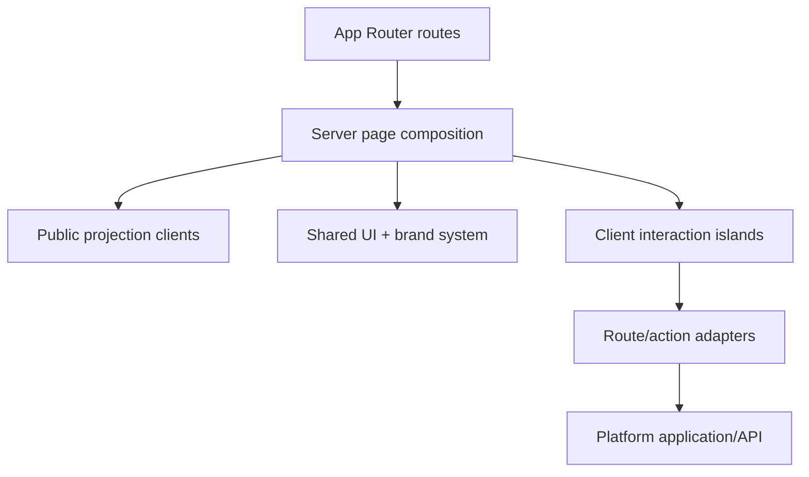

# 04 — C4 Level 3: Customer and Operator Web Components

## Component view

## Components and ownership

| Component | Responsibilities | Prohibited responsibilities |
|---|---|---|
| Route/layout layer | Metadata, routing, loading/error boundaries, locale and structural accessibility | Product/payment/inventory truth. |
| Server page composition | Fetch public projections, compose editorial/product content, render HTML | Mutating canonical state during render. |
| Public projection clients | Typed reads for catalog, recipe, policy and order-public views | Returning protected evidence or operator fields. |
| Commerce interaction islands | Variant selection, cart drawer, quantity, checkout form progress | Trusting browser subtotal, price or availability. |
| Form components | Accessible controls, shared Zod hints, pending/error/success states | Treating an HTTP acknowledgement as successful external delivery. |
| Route/action adapters | Parse request, session/CSRF checks, invoke application use case, map response | Duplicating domain rules or provider calls. |
| Design system | Tokens, typography, buttons, fields, cards, dialogs, focus and motion primitives | Business state or data fetching. |
| Operator feature routes | Role-aware views/actions for support, fulfilment, finance, product truth and B2B | Direct database/provider mutation. |

## Route architecture

| Route family | Rendering/data strategy | Notes |
|---|---|---|
| `/`, `/our-roots`, `/impact`, `/faq`, legal | Static/cached server output | Invalidate on approved content release. |
| `/shop`, `/products/[slug]` | Cached public catalog projection | Availability/price TTL and explicit revalidation; checkout rechecks. |
| `/recipes`, `/recipes/[slug]` | Static/cached editorial projection | Protected claims referenced, never copied ad hoc. |
| `/cart` | Server shell + client cart island | Local cart is convenience state only. |
| `/checkout` | Dynamic server shell + secure form state | Server quote/order ID controls totals and expiry. |
| `/order/[publicToken]` | Dynamic, token/session scoped | Reveal minimum delivery/payment status; prevent enumeration. |
| `/b2b`, waitlist surfaces | Server page + validated mutation | Purpose-specific consent and abuse protection. |
| `/ops/*` | Dynamic, authenticated and authorized | No public caching; security headers and audit on mutation. |

## Client-state policy

Use client state for UI affordances, draft form progress, cart convenience and device preference. Do not store payment status, inventory reservation, consent history, claim approval or operator permissions in browser storage as authoritative data.

Cart rehydration rules:

1. Parse defensively and discard corrupt entries.
2. Migrate or clear incompatible cart versions.
3. Send only product/variant IDs and quantity for server quote.
4. Display server differences explicitly: changed price, unavailable variant, adjusted quantity or expired quote.
5. Never submit browser `unitPrice` as authority.

## Accessibility and performance contracts

- WCAG 2.2 AA for launch-critical customer and operator paths.
- Semantic landmarks, skip link, visible focus, error summary, field association and status announcements.
- Keyboard-complete navigation, cart, modal/dialog and filters; 44px-class touch targets where practical.
- Respect reduced-motion preferences; animation cannot gate information/action.
- Server Components by default; client boundaries are deliberate and measured.
- Optimize images with stable dimensions, responsive sizes and meaningful alternatives.
- Set route budgets for JS, images and Core Web Vitals; performance regression is reviewed like functional regression.

## Error behavior

Every mutation distinguishes validation, conflict, rate limit, dependency unavailable and unexpected failure. Preserve user input where safe, show a stable request/reference ID for support, and never display stack traces or provider error bodies.

## Web component tests

- Server route metadata and public projection suppression.
- Form validation, keyboard flow, pending/double-submit prevention and error recovery.
- Cart versioning, price/stock revalidation and empty/unavailable states.
- Accessibility automation plus manual keyboard/screen-reader sampling.
- Responsive screenshots for primary breakpoints using approved assets.
- End-to-end browse → waitlist/B2B and browse → cart → checkout sandbox journeys.
