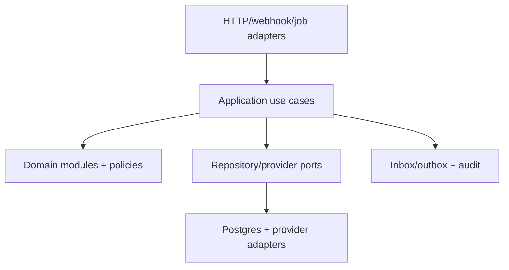

# 05 — C4 Level 3: Platform API and Worker Components

## Component view

## Layer rules

| Layer | May depend on | Must not depend on |
|---|---|---|
| Domain | language/runtime primitives | HTTP, React, SQL, provider SDK, environment variables |
| Application | domain + port interfaces + transaction abstraction | Concrete database/provider SDKs |
| Transport | validation schemas + application use cases | SQL/provider calls or duplicated domain transitions |
| Infrastructure | ports + external SDK/database driver | UI modules |
| Composition root | all required implementations | Business logic |

## Domain modules

| Module | Aggregate roots / policies | Representative commands |
|---|---|---|
| Product truth | Product, Specification, Claim, Evidence, Artwork, Approval | approve specification, approve/expire claim, publish projection |
| Catalog/pricing | Variant, PriceList, Price, AvailabilityProjection | activate price, build public product projection |
| Consent/waitlist | Contact, ConsentRecord, WaitlistSubscription, Preference | subscribe, confirm, withdraw, suppress, notify launch |
| B2B | Lead, Activity, SampleRequest, SampleShipment | capture lead, qualify, assign, approve/ship sample |
| Cart/checkout | CartQuote, CheckoutSession | quote cart, accept checkout, expire quote |
| Order | Order, OrderLine, Adjustment | create, cancel, allocate, fulfil, close |
| Payment | PaymentIntent, Attempt, Refund, ReconciliationException | create session, apply event, refund, reconcile |
| Inventory/lot | Lot, Movement, Reservation, RecallAction | receive, release, reserve, allocate FEFO, quarantine/recall |
| Fulfilment | Package, Shipment, TrackingEvent, Exception | pack, dispatch, apply carrier event, return |
| Operations | Complaint, OperatorTask, IncidentReference, AuditEvent | classify/escalate, assign/resolve task |

## Application use-case pattern

Each mutating use case performs:

1. authenticate principal and authorize action;
2. parse/validate external input;
3. resolve idempotency key and canonical request hash;
4. load aggregates in a bounded transaction with required locks;
5. enforce invariant and explicit state transition;
6. persist state, audit event and outbox message atomically;
7. return stable public result; external delivery occurs after commit unless required synchronously.

## Worker components

| Worker | Trigger | Idempotency identity | Failure outcome |
|---|---|---|---|
| Outbox dispatcher | leased outbox rows | event ID + destination | retry, then owned dead-letter task |
| Webhook processor | verified inbox row | provider + event ID | retry mapping; unknown state escalates |
| Reservation expiry | schedule/due index | reservation ID + expiry version | release once and audit |
| Payment reconciliation | schedule/manual | provider report/transaction reference | create/update finance exception |
| Communications | outbox event | communication intent ID | delivery retry/suppression; order remains committed |
| CRM sync | outbox event | local lead/activity version | retry and visible sync status |
| Fulfilment poll/reconcile | schedule/webhook gap | provider shipment/event reference | operator exception if stale/mismatched |
| Evidence/claim expiry | schedule | approval/evidence version | suppress public projection and notify owner |

## Transaction and concurrency policies

- Use unique constraints as final duplicate defense.
- Lock the smallest aggregate/stock rows required and use consistent lock ordering.
- Inventory reservation and movement creation commit atomically.
- Payment events can arrive duplicate/out of order; transitions are monotonic and policy-driven.
- External side effects never occur inside an uncommitted database transaction unless the provider operation is itself safely idempotent and a recovery record is written first.
- Unknown provider state creates an exception; it is never coerced to success/failure.

## Component observability

Every use case emits structured duration/result counters and trace spans tagged with safe identifiers: use-case name, result code, environment, provider and hashed/opaque resource ID. Do not put email, phone, address, message/free text, raw evidence or payment payloads in telemetry.

## Extraction seams

Component boundaries are logical, not separate services. A component becomes a service only with measured scaling/failure/team/security pressure and after it owns an explicit API/event contract, data migration, replay/reconciliation, SLO, deployment and on-call path.
