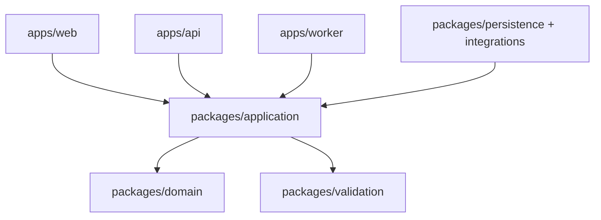

# 06 — Technology Stack and Repository Architecture

## 1. Current locked foundation

Versions below reflect the repository on 2026-08-04. Upgrades require a dedicated change, migration notes and full quality gate.

| Concern | Technology | Current version/policy | Rationale |
|---|---|---|---|
| Runtime | Node.js | `>=22.13.0` | Supported modern TypeScript/server tooling baseline. |
| Language | TypeScript | `5.9.3`, strict | Shared types, exhaustive state handling and safer refactors. |
| Monorepo | npm workspaces + Turborepo | npm `11.9.0`, Turbo `2.10.8` | Simple dependency graph and cached task orchestration. |
| Web | Next.js App Router + Vinext | Next `16.3.0`, Vinext `0.0.50` | Server-first React with Cloudflare-compatible production artifact. |
| UI | React | `19.2.6` | Server Components plus targeted client interactions. |
| Styling | Tailwind/PostCSS + shared tokens | Tailwind `4.2.1` | Brand system and responsive composition. |
| Forms | React Hook Form + Zod resolver | RHF `7.84`, resolver `5.7` | Accessible client UX with shared validation semantics. |
| Validation | Zod | `4.4.3` | Runtime schemas at untrusted boundaries. |
| Persistence mapping | Drizzle ORM/Kit | ORM `0.45.2`, Kit `0.31.10` | Typed SQL mapping and reviewable migrations. |
| Build/runtime | Vite, Wrangler, Cloudflare plugin | pinned in `apps/web` | Sites-compatible artifact and worker runtime. |
| Quality | ESLint, TypeScript, Node test runner | locked CI | Fast deterministic baseline; expand by risk. |

## 2. Planned production capabilities

| Capability | Direction | Selection gate |
|---|---|---|
| Transaction database | Managed PostgreSQL with PITR | Region, restore evidence, connection model, cost and exit/export. |
| Object storage | Private S3-compatible/managed bucket | Encryption, signed access, checksums, audit, retention and data location. |
| Payment | Hosted flow from approved/authorized provider | Methods, webhook/security, idempotency, settlement export, refunds, SLA and cost. |
| Communications | Transactional email adapter; marketing adapter separated | Deliverability, suppression, templates, data processing terms and export. |
| Fulfilment/logistics | Adapter to 3PL/carrier or controlled internal workflow | Lot capture, address support, tracking/reconciliation, exceptions and export. |
| Operator identity | Managed identity with MFA | Role/group support, audit, recovery, session control and lifecycle. |
| Telemetry | OpenTelemetry-compatible signals + managed backend | Redaction, sampling, retention, alerts, cost and export. |

Provider names are deliberately not embedded until due diligence/ADR approval. Application contracts must remain provider-neutral.

## 3. Dependency direction



The infrastructure packages implement inward-facing ports; application/domain packages never import concrete infrastructure. `packages/ui` may be imported by web surfaces only.

## 4. Target repository structure

```text
apps/
  web/                    customer + initial operator surfaces
  api/                    HTTP and webhook composition root
  worker/                 planned durable background processing
packages/
  domain/                 pure aggregates, value objects, policies
  application/            planned use cases, ports, transaction boundary
  persistence/            planned PostgreSQL repositories/migrations
  integrations/           planned payment, fulfilment, email, CRM adapters
  validation/             transport schemas and generated API types
  commerce/               current facade; compatibility/migration boundary
  ui/                     tokens and accessible primitives
  config/                 shared TypeScript/lint/test configuration
infrastructure/           environment contracts, deployment and runbooks
docs/development/         build contract
docs/production/          operate/release contract
```

## 5. Package rules

- Every package declares public exports; consumers do not import private paths.
- Avoid cyclic workspace dependencies; CI enforces the allowed dependency graph.
- Domain errors are typed codes/classes, not string comparisons.
- Shared validation schemas are transport contracts, not substitutes for domain authorization.
- Provider SDK types stop at adapter boundaries.
- `dist`, caches and generated environment artifacts are never treated as source.
- Migrations are append-only source artifacts and receive owner review.

## 6. Configuration and secrets

Configuration is parsed once at composition roots with a typed schema. Distinguish build-time public variables, runtime non-secret configuration and runtime secrets. Reject missing/invalid production configuration at startup. Never expose server secrets through `NEXT_PUBLIC_*`, logs, error payloads or client bundles.

## 7. Upgrade policy

Routine dependency changes are small, locked and independently reviewable. Framework/runtime upgrades include release-note review, migration/codemod output, build/runtime/browser regression, adapter compatibility and rollback plan. Security patches may be expedited but still require the applicable critical-path tests.
