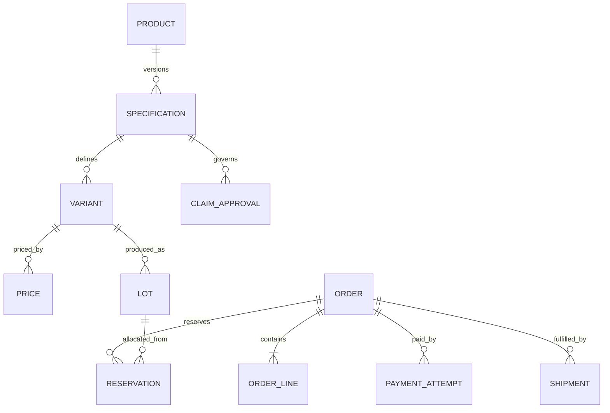
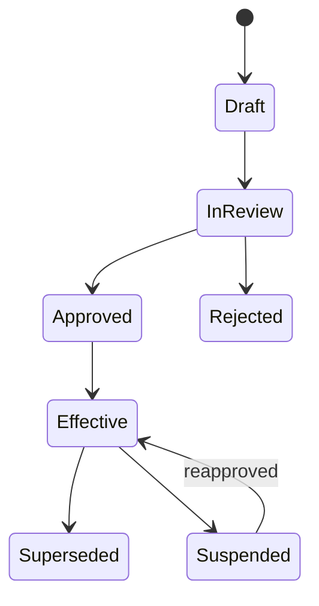
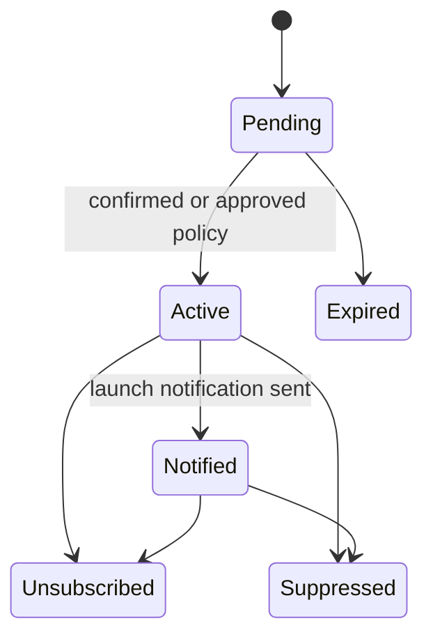
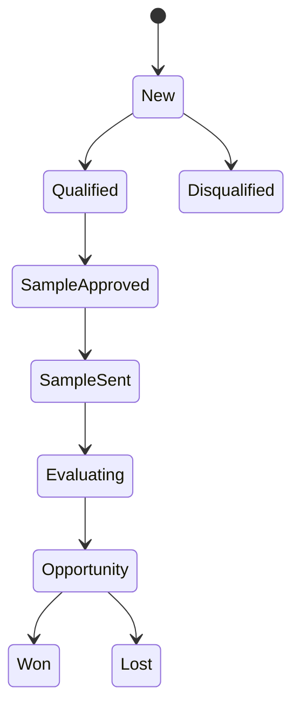
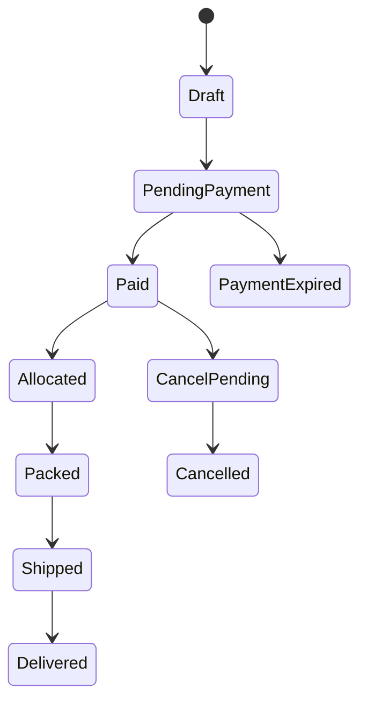
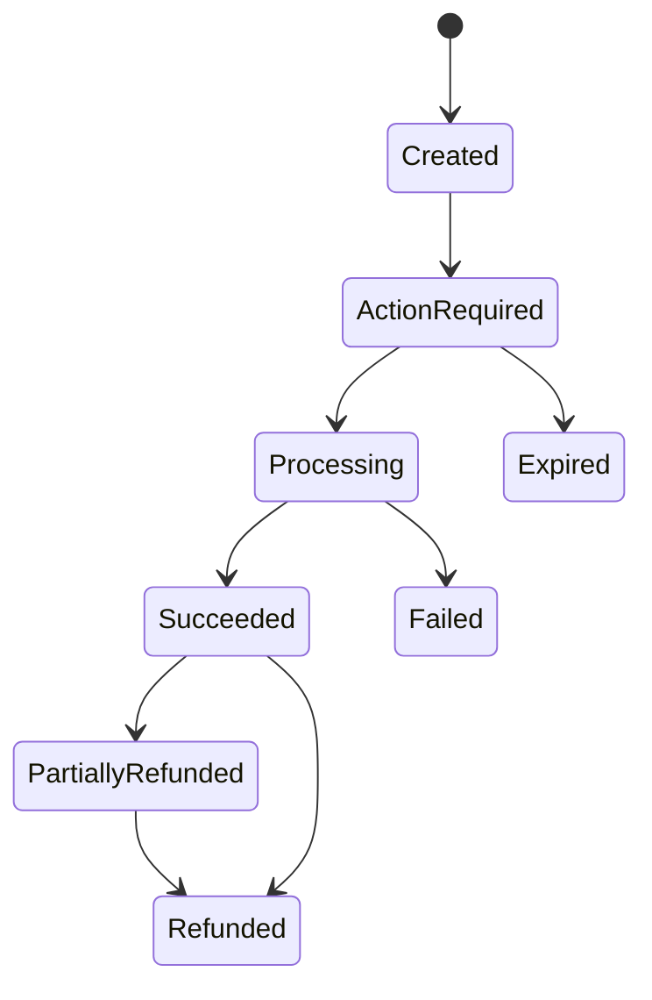

# 07 — Domain Model and State Machines

## 1. Modeling rules

- Use opaque identifiers and explicit value objects for money, quantity, weight, email/phone, time window and provider references.
- Money is integer minor units plus ISO currency; quantities include unit and precision.
- State changes occur through named domain commands/policies, never arbitrary property mutation.
- Approved product specifications, claims and financial history are superseded/compensated, not rewritten.
- Order lines snapshot what the customer bought and what Yubie represented at purchase time.

## 2. Core aggregate map

## 3. Product truth lifecycle

Publication requires the effective specification, effective claim approvals, matching artwork scope, and non-expired evidence. A new formula, net content, SKU form, label or protected fact creates a new version/review rather than mutating the approved record.

## 4. Waitlist lifecycle

Waitlist interest is per product/variant family and purpose. It is not an order, reservation, price promise or launch-date commitment.

## 5. B2B lead lifecycle

Every nonterminal qualified state has owner, next action and due date. Sample approval does not bypass lot release, inventory movement or recipient traceability.

## 6. Order and payment separation

Order states:

Payment attempt states:

The browser redirect never moves `PendingPayment` to `Paid`. Only a verified event or reconciliation result may do so.

## 7. Inventory and lot state

Lot lifecycle: `received → quarantined → released → depleted/expired`; released lots may move to `quarantined` or `recalled` at any time. Sellable quantity is derived from released, compatible, non-expired, non-recalled balance minus active reservations and safety buffer.

Inventory movements are append-only: receive, release, reserve, reservation release, pick/consume, return pending inspection, damage, expiry, quarantine, recall and correction. A correction references the error and compensates it; it does not delete history.

## 8. Transition contract

Every transition definition contains:

- command and authorized actor;
- current/next state and forbidden states;
- required product/lot/payment predicates;
- idempotency identity;
- database lock/transaction scope;
- movement/financial/audit effects;
- outbox events and operator task;
- customer-visible consequence;
- timeout/expiry and compensating action;
- unit and integration tests.

## 9. Current model migration

The existing `Product`, `ProductSize`, `Order` and `ProductClaim` interfaces remain useful public/prototype projections. Do not grow them into universal persistence entities. Introduce internal aggregates/value objects and map them to stable public DTOs so product-truth history, multiple price lists, attempts, lots and audit do not leak into customer responses.
