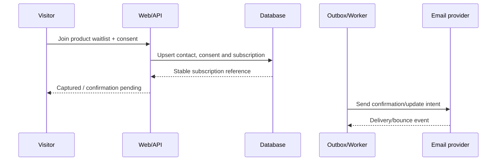
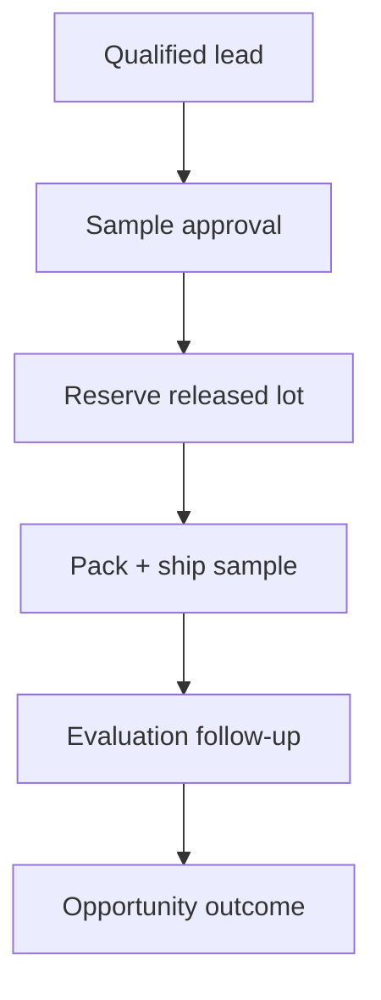

# 11 — Waitlist, Newsletter, B2B and CRM Development

## 1. Separate purposes

Do not model every form as one generic lead. Purpose determines consent, lifecycle, communication and retention.

| Capture | Purpose | Required scope |
|---|---|---|
| Product waitlist | Notify interest holder about a named coming-soon product | Contact, product scope, source, consent/policy version, state. |
| Newsletter/community | Ongoing permitted brand/product communication | Contact, topics/channels, consent/policy version, suppression. |
| B2B enquiry | Respond to a business request and assess fit | Business/contact, product/use case, estimated need, city, source, owner/stage. |
| B2B sample | Controlled physical product distribution | Approved request, recipient/address, exact SKU/specification/lot, quantity and shipment. |

Joining a waitlist must not silently enroll someone into a broader newsletter. A B2B operational response must not be reclassified as indefinite marketing consent.

## 2. Waitlist vertical slice

### Waitlist data

- `contact_id`, normalized email, optional name;
- `product_id` and optional variant/form scope;
- lifecycle status and status reason;
- consent purpose/channel, policy/version, captured timestamp/source/IP evidence policy;
- source route/campaign allowlist, locale/timezone;
- confirmation token hash/expiry where confirmation is required;
- notified release/version and notification timestamp;
- suppression/unsubscribe/bounce/complaint metadata;
- created/updated and audit references.

Never store plaintext confirmation/unsubscribe tokens; store hash and use scoped, expiring opaque tokens.

## 3. Waitlist API behavior

- Repeated same-contact/same-product submission is idempotent and does not send uncontrolled duplicate mail.
- Public response does not reveal whether an email already exists.
- Coming-soon copy states interest only; no reservation, fixed launch date, price or availability promise.
- Launch notification is a versioned campaign with recipient query evidence, dry run, owner approval, rate limit and completion report.
- Unsubscribe/suppression is processed immediately for future marketing delivery and synchronized to providers.

## 4. Newsletter lifecycle

Capture topic/channel preferences separately from waitlist product interest. Record consent grant/withdrawal as immutable ledger events and derive current permission. Handle provider bounce/complaint as suppression without deleting the audit/history required to honor it. Marketing provider outages do not lose local subscription truth.

## 5. B2B lead vertical slice

1. Validate and normalize business/contact fields.
2. Deduplicate conservatively by normalized email/phone/business signals; never discard a new enquiry silently.
3. Create lead, consent/purpose, activity and assignment task atomically.
4. Send acknowledgment through outbox with realistic service expectation.
5. Sync a projection to CRM; local record remains durable until an ADR explicitly changes source ownership.
6. Track sync version/status/error without exposing provider payload to UI.

## 6. B2B lead model

| Group | Fields |
|---|---|
| Contact | name, email, WhatsApp, preferred channel |
| Business | name, type, city, optional registration/account metadata after qualification |
| Demand | product interest, use case, expected monthly need as user-provided text/normalized range, timeline |
| Pipeline | status, owner, score/reason, next action/due date, source/campaign |
| Consent | purpose, channel, policy/version, grant/withdrawal |
| Activity | timestamp, actor, type, outcome, restricted notes |
| Sync | provider, external reference, local version, last success/failure |

Free text is confidential, excluded from analytics and escaped in every operator surface.

## 7. Sample workflow

Sample shipments use the same lot release, movement, quarantine and recall logic as paid orders. At minimum record recipient, address, SKU, specification, lot, quantity, dispatch/delivery, owner and recall-contact status.

## 8. Abuse, privacy and retention

- Rate limit by multiple safe signals; avoid permanent raw IP retention unless approved.
- Normalize email/phone carefully and encrypt sensitive fields at rest where threat model requires.
- Restrict B2B notes and exports by role; all exports are audited and expire.
- Retain inactive/disqualified leads only for an approved purpose/window, then anonymize/delete subject to holds.
- Provide consent evidence and data-request search across waitlist, newsletter, CRM projection and communication provider.

## 9. Metrics

- Capture success/error/duplicate rate without contact identifiers.
- Waitlist confirmed/active/unsubscribed/suppressed by product and source.
- Launch notification delivery and downstream approved-product engagement.
- B2B new → qualified → sample → opportunity → won conversion and stage aging.
- Sample delivery and lot traceability completeness.

Metrics are diagnostic/derived; the consent ledger and lead/sample records remain canonical.
