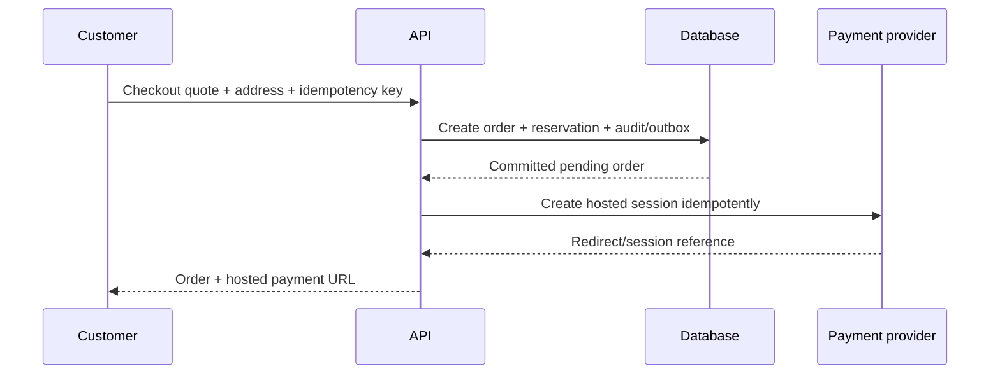

# 12 — Commerce, Checkout and Payment Development

## 1. Scope and boundaries

The commerce system owns authoritative quote, order, reservation and normalized payment observations. A hosted payment provider owns payment collection and settlement execution. The customer browser owns neither totals nor payment truth.

## 2. Cart versus quote

| Object | Location | Authority | Expiry |
|---|---|---|---|
| Device cart | browser local storage | Convenience only | Until cleared/migrated. |
| Cart quote | server/database or signed short-lived projection | Price/availability offer for a bounded window | Explicit `expiresAt`. |
| Order | PostgreSQL | Commercial transaction snapshot | Retained per policy. |

`POST /v1/cart-quotes` accepts product/variant IDs and quantity only. The server loads active prices, sellability and quantity rules, returns line differences and a quote reference. Checkout consumes a valid quote but revalidates launch-critical predicates transactionally.

## 3. Checkout sequence



If provider session creation fails after the order commits, store/reuse a recoverable `payment_session_pending/failed` condition. Retrying with the same idempotency identity must not create another order.

## 4. Server-owned calculations

- Product/variant sellability and quantity limits.
- Unit price, discount/promotion eligibility, shipping, tax treatment and total.
- Address/serviceability and fulfilment method.
- Reservation duration and safety buffer.

Order lines snapshot product/variant display name, specification/public-fact version, unit/quantity, price components and currency. Do not trust client price, product name or provider-calculated order description as Yubie truth.

## 5. Payment integration port

```ts
interface PaymentProvider {
  createHostedSession(input: CreateHostedSessionInput): Promise<HostedSessionResult>;
  fetchPayment(reference: ProviderPaymentReference): Promise<ProviderPaymentSnapshot>;
  createRefund(input: CreateRefundInput): Promise<RefundResult>;
  verifyWebhook(rawBody: Uint8Array, headers: Headers): VerifiedProviderEvent;
  listReconciliationWindow(input: ReconciliationWindow): AsyncIterable<ProviderTransaction>;
}
```

Adapter contract includes timeout, idempotency support, error mapping, event ordering, sandbox differences, settlement identifiers, rate limits and export path. Raw SDK/provider types do not escape the adapter.

## 6. Webhook processing

1. Read exact raw bytes and bounded headers/body size.
2. Verify signature, timestamp tolerance and expected environment/account.
3. Insert unique inbox record containing safe metadata and encrypted/restricted payload reference if retention is necessary.
4. Acknowledge only after durable capture.
5. Worker maps the verified event to domain transition under transaction/lock.
6. Duplicate returns prior result; out-of-order/unknown event creates a reconciliation exception.

## 7. Refunds and cancellation

Refund request is a separate authorized/idempotent command linked to original order/payment, reason and approval policy. Provider timeout leaves an explicit unknown/pending state resolved by fetch/reconciliation, never automatic repeated refund calls. Inventory from a food return never becomes sellable without inspection/disposition policy.

## 8. Reconciliation

Daily job compares Yubie attempts/refunds with provider transaction and settlement reports. Detect missing local/provider record, amount/currency mismatch, duplicate success, late success, unresolved processing, refund mismatch and settlement variance. Every exception has severity, owner, due time, evidence and resolution; finance closes only after approved reconciliation evidence.

## 9. Failure matrix

| Failure | Expected behavior |
|---|---|
| Double click/network retry | Same idempotent order/session result. |
| Price changed | Quote conflict with explicit line difference; no hidden total change. |
| Final stock contested | One reservation succeeds; others receive unavailable conflict. |
| Provider timeout creating session | Recoverable pending/unknown state; fetch before retrying provider operation. |
| Redirect says success but no event | Remain pending; reconcile/poll provider. |
| Duplicate/out-of-order webhook | Deduplicate and apply only valid monotonic transition. |
| Late success after order expiry | Finance/ops exception; do not silently fulfil. |
| Refund timeout | Resolve provider truth before retry; avoid duplicate refund. |

## 10. Development gate

Payment sandbox work begins only after durable order/reservation/idempotency/inbox/outbox and operator order/payment visibility exist. Production activation additionally requires provider, product, food-operation, privacy, security and go-live approvals from the production handbook.
