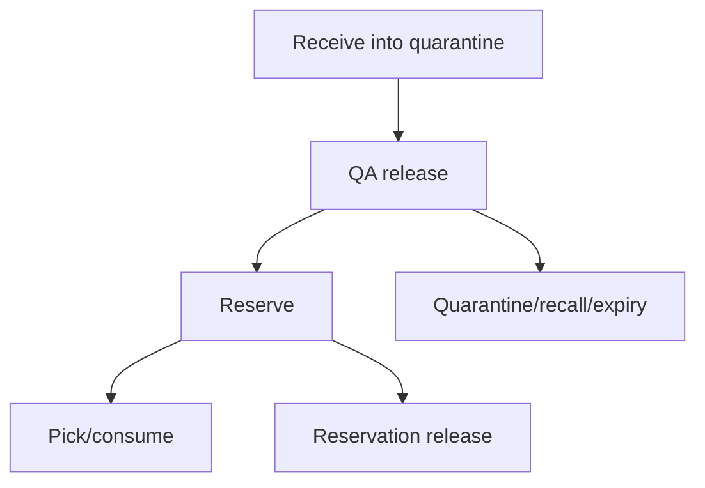
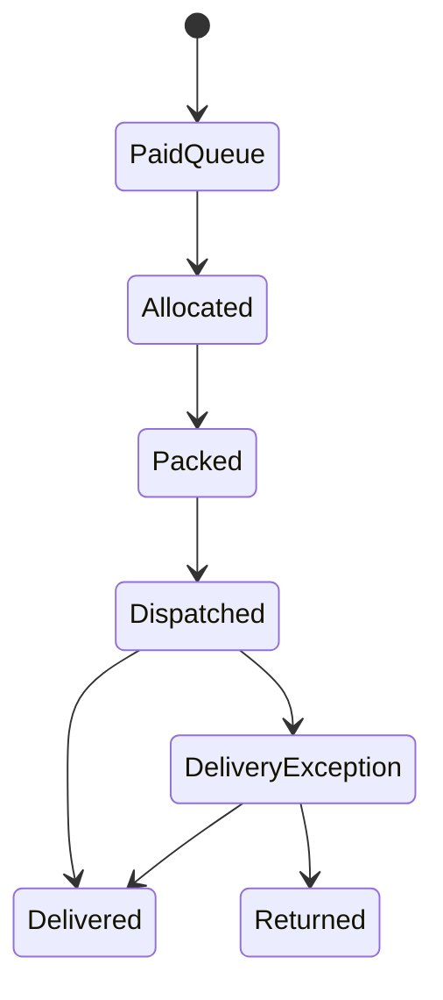

# 13 — Inventory, Lot, Fulfilment and Recall Development

## 1. Food-commerce invariant

An available SKU is not automatically sellable inventory. Sellability requires an effective product specification, approved public projection, active price, compatible released lot, non-expired stock, no quarantine/recall and sufficient unreserved balance.

## 2. Lot model

Minimum lot record:

- internal ID and lot/batch code within owner/facility context;
- exact product specification, variant/SKU and packaging/artwork version;
- supplier/manufacturer/facility references and production/receipt dates;
- quantity/unit, best-before/expiry and storage condition;
- evidence/release decision, releaser, timestamp and notes/reference;
- lifecycle: received, quarantined, released, depleted, expired, recalled;
- current location and movement-derived balance.

Shake and Ppang remain coming soon until their product gates pass. Fresh/chilled Ppang and frozen Ppang are separate variants/SKUs with distinct storage, shelf-life, fulfilment and customer promises.

## 3. Movement ledger



Balances are derived from append-only movements. Corrections are compensating movements with actor/reason/reference. Never edit stock quantity without preserving the original event and correction.

## 4. Availability and reservation

```text
sellable = released compatible on-hand
         - active reservations
         - allocated/picked quantity
         - quarantine/recall/expiry exclusion
         - approved safety buffer
```

Reservation creation locks/atomically updates the affected inventory position, has order/quote scope, expiry and release reason, and is idempotent. Reservation expiry is a durable scheduled command. Do not extend reservations indefinitely because a browser remains open.

## 5. FEFO allocation

Allocate First-Expired-First-Out among released compatible lots, respecting minimum remaining shelf-life at expected delivery and channel/customer rules. A documented exception includes operator, reason and resulting traceability. FIFO is insufficient when expiry dates differ.

## 6. Fulfilment sequence



Packing preconditions: order payment/approval state valid, reservation active, exact lot allocated, quantity matches, lot remains released, packaging/label version valid and address/service method approved. Capture picker/packer, lot, package, carrier/tracking and timestamps.

## 7. Provider/3PL integration

Yubie sends normalized shipment intent only after canonical allocation. Adapter stores provider reference and maps events such as label created, picked up, in transit, delivered, failed delivery, damaged, lost and returned. Duplicate/out-of-order events are safe. Stale tracking or provider mismatch creates an operator task and reconciliation path.

## 8. Returns and disposition

Returned food never automatically re-enters sellable stock. Record return reason, packaging integrity, temperature/storage concerns where applicable, inspection, evidence and disposition: destroy, quarantine, investigation or approved non-sale path. Suspected illness, allergen/label issue, contamination, foreign object or packaging integrity escalates to food-safety incident handling.

## 9. Recall/traceability query

Given a lot, the platform must identify:

- remaining balance by location and status;
- active reservations, allocations and packages;
- paid/delivered/returned orders and customer contact path;
- B2B samples and recipients;
- related complaints, suppliers/specification/artwork and communication status.

Given an order/sample, it must identify exact allocated lot(s). The query and exported recipient list are access-controlled and audited.

## 10. Test requirements

- Concurrent reservation of final unit.
- Quarantined, recalled, expired or unreleased lot excluded.
- FEFO with multiple compatible lots and minimum shelf-life.
- Lot quarantined after reservation/before pack triggers block/task.
- Partial allocation, split package and cancellation release.
- Duplicate carrier event and missing tracking reconciliation.
- Recall exercise reaches D2C orders and B2B samples with complete status.
