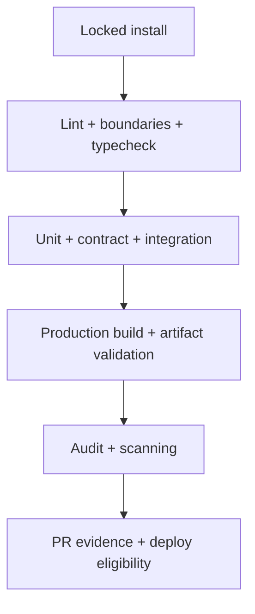

# 16 — Testing, CI/CD and Developer Experience

## 1. Local workflow

```bash
npm ci
npm run dev:web
npm run dev:api
npm run check
```

Local services use synthetic configuration and fake/sandbox adapters. Provide a checked-in environment key contract without secrets, deterministic seed command and documented reset. Developer setup must not require production credentials or customer data.

## 2. Test portfolio

| Layer | Focus | Examples |
|---|---|---|
| Domain unit | Pure invariants/state transitions | totals, claim visibility, consent, FEFO, order/payment transitions |
| Application unit | Use-case orchestration with fake ports | idempotency, authorization, outbox/audit, error mapping |
| Database integration | Real PostgreSQL constraints/transactions | concurrent reservation, unique event, migrations, rollback behavior |
| API contract | Zod/OpenAPI/status/headers | public/operator errors, pagination, idempotency, webhook signature |
| Adapter contract | Provider mapping and failure matrix | timeout, 429/5xx, duplicate/late event, unknown provider state |
| Component/accessibility | UI behavior | forms, cart conflict, keyboard/focus, reduced motion, announcements |
| End-to-end | Customer/operator vertical journey | browse → waitlist; quote → sandbox payment → fulfilment/refund |
| Operational exercise | Recovery and safety | restore, reconciliation, provider outage, privacy request, recall |

## 3. CI pipeline



Current CI already installs, lints, typechecks, tests, builds and audits. Add incrementally:

- package-boundary/cycle enforcement;
- migration bootstrap and upgrade tests against PostgreSQL;
- OpenAPI/schema drift and compatibility;
- accessibility/component tests;
- critical E2E against ephemeral environment;
- secret/code/dependency/container or artifact scanning as applicable;
- generated artifact and source-cleanliness checks;
- affected-task optimization without skipping required global gates.

## 4. Test data and provider safety

- Provider sandbox and webhooks use dedicated environment accounts/secrets.
- Email/SMS/WhatsApp in non-production is sinked or recipient-allowlisted.
- Payment fixtures are provider-approved test values only.
- Real addresses, contact lists, evidence exports and support tickets are prohibited in CI/dev.
- Time, UUID and provider responses are controllable for deterministic tests.

## 5. Pull request policy

PRs are small vertical slices and link the relevant development/production contract. Include outcome, state/invariant changes, API/data/migration, security/privacy, observability, rollout/rollback and evidence. High-risk areas request explicit product-truth, payment/finance, food-safety, privacy/security or operations reviewer as applicable.

## 6. Deployment path

1. Build immutable artifact from reviewed commit.
2. Apply backward-compatible migration using controlled job/step.
3. Deploy with environment-scoped configuration and health checks.
4. Run smoke/synthetic checks and watch SLO/business guardrails.
5. Progressively enable feature/provider/cohort.
6. Roll back application or roll forward database safely; never assume destructive schema rollback.
7. Record deployment marker, owner and observation outcome.

## 7. Flaky/failing gate policy

Do not merge by rerunning until green without diagnosis. Critical flaky tests are release blockers. Quarantine requires owner, issue, risk analysis and deadline; no payment, inventory, claim, privacy or recall test is silently quarantined.

## 8. Development quality metrics

Track change failure rate, lead time to production, rollback/incident rate, flaky test rate, critical-path coverage, migration failure, escaped defect class and mean time to restore. Do not optimize commit count or raw velocity at the expense of food/transaction correctness.
