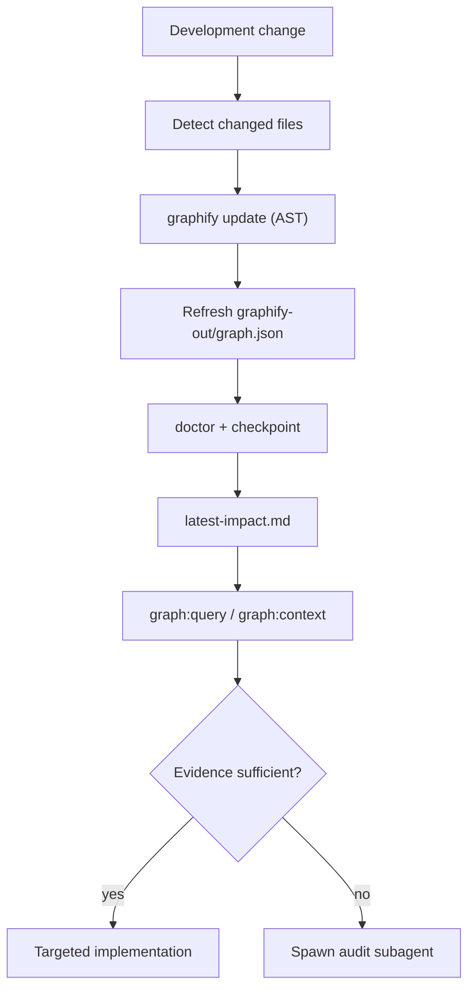

# Graphify Engineering Intelligence Workflow

Yubie maintains a local architectural/code knowledge graph via [Graphify](https://github.com/safishamsi/graphify) so Cursor agents can query engineering context instead of repeatedly running broad repository audits.

## Architecture



## Prerequisites

- **Graphify CLI** 0.9.46+ (`uv tool install graphifyy`)
- **Node.js** 22+ (checkpoint/impact scripts)
- **Optional:** `GEMINI_API_KEY`, `GOOGLE_API_KEY`, `ANTHROPIC_API_KEY`, or `OPENAI_API_KEY` for semantic docs indexing
- **Optional:** `DATABASE_URL` for live PostgreSQL schema extraction at bootstrap

## Quick start

```bash
# One-time full graph (code-first, offline)
npm run graph:bootstrap

# Incremental update after edits
npm run graph:update

# Agent entry point
npm run graph:context

# Enable automatic git hooks (local repo only)
npm run graph:setup-hooks
```

## Commands

| Command | Purpose |
|---------|---------|
| `npm run graph:bootstrap` | Initial full graph (`graphify extract --code-only`) |
| `npm run graph:update` | Incremental AST update from git/manifest changes |
| `npm run graph:doctor` | Health, staleness, and graph presence checks |
| `npm run graph:watch` | File watcher for active development |
| `npm run graph:query -- "<question>"` | Query the engineering graph |
| `npm run graph:query -- --view contracts` | Query using a preset view |
| `npm run graph:context` | Update + doctor + impact report + summary |
| `npm run graph:setup-hooks` | Set `core.hooksPath` to `.githooks` |

## What gets indexed

Included (via [`.graphifyignore`](../.graphifyignore)):

- `apps/**`, `packages/**`, `infrastructure/**`, `docs/**`, `.github/**`
- Root docs: `AGENTS.md`, `DESIGN.md`, `README.md`, `package.json`, `tsconfig*.json`

Excluded: `node_modules/`, `dist/`, `.next/`, `.env*`, credentials, generated assets, large binaries.

**Never ingest secrets or customer data.**

## Bootstrap vs incremental

### Bootstrap (first run)

1. `graphify extract . --code-only --no-viz` — offline AST for TypeScript/JavaScript/config
2. If an LLM API key is set → `graphify update docs/` for ADR/runbook semantic nodes
3. If `DATABASE_URL` is set → optional Postgres schema extraction
4. Writes `.graphify/checkpoint.json` at `HEAD`
5. Generates `.graphify/reports/latest-impact.md`

### Incremental update

Uses Graphify's native `graphify update .` (manifest-based). Our wrapper:

- Tracks last successful index SHA in `.graphify/checkpoint.json`
- Classifies changed files into seven engineering views
- Regenerates the impact report
- **Does not advance checkpoint on failure**

## Seven engineering views

Defined in [`.graphify/config.yml`](../../.graphify/config.yml):

| View | Covers |
|------|--------|
| **contracts** | APIs, ports, integrations, webhooks, queues |
| **infrastructure** | Docker, Compose, VPS topology, health checks |
| **boundaries** | apps/packages layer rules |
| **database** | migrations, repositories, schema |
| **security** | auth, webhook verification, trust boundaries |
| **tests** | `*.test.mjs` mappings |
| **documentation** | ADRs, runbooks, architecture docs |

## Automatic hooks

After `npm run graph:setup-hooks`:

| Hook | When | Behavior |
|------|------|----------|
| `post-commit` | After commit | Background incremental update |
| `post-merge` | After merge/pull | Background update from `ORIG_HEAD..HEAD` |
| `post-checkout` | Branch switch | Background update |

Hooks are **non-blocking** and **never fail git**. Opt out: `GRAPHIFY_SKIP_HOOK=1`.

Logs: `.graphify/logs/hooks.log`

## Agent workflow

1. `npm run graph:context`
2. Read `.graphify/reports/latest-impact.md`
3. `npm run graph:query` per affected view
4. Spawn audit subagents only for stale/missing evidence

See also [.agents/workflows/graphify-context.md](../../.agents/workflows/graphify-context.md).

### Example queries

```bash
npm run graph:query -- "Show integration contracts affected by current diff"
npm run graph:query -- "Show architectural boundary violations"
npm run graph:query -- "Show database tables and migrations affected by current diff"
npm run graph:query -- "Show security trust boundaries affected by current diff"
npm run graph:query -- "Show tests covering files changed in current branch"
npm run graph:query -- "Show documentation/ADR impacted by current diff"
```

## Local artifacts (gitignored)

| Path | Purpose |
|------|---------|
| `graphify-out/` | Graph JSON, manifest, reports |
| `.graphify/checkpoint.json` | Last successful index SHA |
| `.graphify/reports/` | Impact reports |
| `.graphify/logs/` | Hook and script logs |

## Rebuild from scratch

```bash
rm -rf graphify-out .graphify/checkpoint.json .graphify/reports
npm run graph:bootstrap
```

## Troubleshooting

| Problem | Fix |
|---------|-----|
| `graphify: command not found` | `uv tool install graphifyy` then `uv tool update-shell` |
| No graph | `npm run graph:bootstrap` |
| Stale graph | `npm run graph:update` or `npm run graph:context` |
| Docs not semantically indexed | Set an LLM API key and re-run bootstrap or `graphify update docs/` |
| Hooks not firing | `npm run graph:setup-hooks` |
| Disable hooks temporarily | `GRAPHIFY_SKIP_HOOK=1 git commit ...` |

## Security

- `.env*` and credentials are excluded via `.gitignore` and `.graphifyignore`
- Code AST extraction is local-only (no network)
- Semantic doc extraction requires an explicit API key you provide
- Do not point Graphify at directories containing customer exports or secrets
