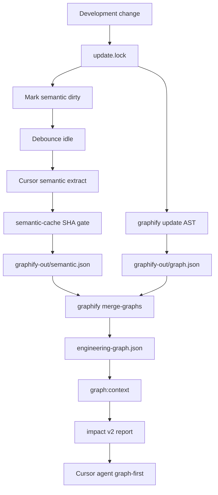

# Graphify Engineering Intelligence Workflow

Yubie maintains a local architectural/code knowledge graph via [Graphify](https://github.com/safishamsi/graphify) plus **Cursor-native semantic indexing** for ADRs, runbooks, and architecture docs. Agents query the merged engineering graph instead of repeatedly running broad repository audits.

## Architecture


```mermaid
flowchart TD
  devChange[Development change] --> lock[update.lock]
  lock --> astUpdate[graphify update AST]
  lock --> semanticDirty[Mark semantic dirty]
  semanticDirty --> debounce[Debounce idle]
  debounce --> cursorExtract[Cursor semantic extract]
  cursorExtract --> cache[semantic-cache SHA gate]
  cache --> semanticJson[graphify-out/semantic.json]
  astUpdate --> astJson[graphify-out/graph.json]
  semanticJson --> merge[graphify merge-graphs]
  astJson --> merge
  merge --> engGraph[engineering-graph.json]
  engGraph --> context[graph:context]
  context --> impact[impact v2 report]
  impact --> agent[Cursor agent graph-first]
```

## Prerequisites

- **Graphify CLI** 0.9.46+ (`uv tool install graphifyy`)
- **Node.js** 22+ (checkpoint, semantic pipeline, impact scripts)
- **Cursor CLI** (`agent`) logged in for semantic doc extraction — **no external LLM API keys required**
- **Optional:** `DATABASE_URL` for live PostgreSQL schema extraction at bootstrap

## Quick start

```bash
# One-time full AST graph (offline, no Cursor calls)
npm run graph:bootstrap

# Batch-index P0 docs via Cursor (default 5 per run)
npm run graph:semantic-bootstrap

# Agent entry point (AST + semantic + impact v2)
npm run graph:context

# Enable automatic git hooks (local repo only)
npm run graph:setup-hooks
```

## Commands

| Command | Purpose |
|---------|---------|
| `npm run graph:bootstrap` | Initial full AST graph (`graphify extract --code-only`) |
| `npm run graph:update` | Incremental AST update; marks doc changes dirty; optional background semantic |
| `npm run graph:semantic-bootstrap` | Cursor semantic extraction for P0 docs (batched) |
| `npm run graph:doctor` | Code + semantic freshness, graph presence |
| `npm run graph:llm-doctor` | Cursor CLI auth + schema/ACP checks |
| `npm run graph:watch` | Debounced watcher (2s AST / 30s semantic dirty marks) |
| `npm run graph:query -- "<question>"` | Query engineering graph (merged when available) |
| `npm run graph:query -- --view contracts` | Query using a preset view |
| `npm run graph:context` | Full agent pipeline: update, semantic, merge, doctor, impact |
| `npm run graph:setup-hooks` | Set `core.hooksPath` to `.githooks` |
| `npm run graph:test` | Fixture tests (no Cursor auth required) |

## Semantic providers (no external API keys)

1. **Cursor CLI** (primary): `agent --print --mode ask --output-format json`
2. **Cursor ACP** (fallback): `agent acp` NDJSON JSON-RPC, read-only capabilities
3. **Degraded**: AST-only when Cursor unavailable (`DEGRADED_NO_CURSOR`)

## Document priority

Configured in [`.graphify/semantic-priority.json`](../../.graphify/semantic-priority.json):

| Tier | When indexed |
|------|----------------|
| **P0** | Auto on change, commit hook, `graph:context` |
| **P1** | On change or `graph:query --view documentation` |
| **P2** | Metadata only unless `--force-semantic` |

## Graph outputs

| File | Contents |
|------|----------|
| `graphify-out/graph.json` | AST code graph |
| `graphify-out/semantic.json` | Semantic doc nodes (from cache) |
| `graphify-out/engineering-graph.json` | Merged via `graphify merge-graphs` |

`graph:query` and `graph:context` prefer `engineering-graph.json` when present.

## Freshness model (checkpoint v2)

`.graphify/checkpoint.json` tracks:

- `code_index_sha` / `semantic_index_sha`
- `semantic_dirty_files`
- `semantic_provider`: `cli` | `acp` | `none`
- `freshness_status`: `FRESH` | `CODE_FRESH_SEMANTIC_STALE` | `STALE` | `DEGRADED_NO_CURSOR` | `BROKEN`

`npm run graph:doctor` reports independent code vs semantic freshness. Never marks `FRESH` after a failed semantic merge.

## Cache

Per-document cache: `.graphify/semantic-cache/<path-sha256>.json`

Skips Cursor when `content_sha256` unchanged, schema version unchanged, and `status=ok`.

## Locking and concurrency

All updaters acquire `.graphify/update.lock` (30s wait, then skip + mark dirty). Atomic writes use `*.tmp` → validate → rename.

## Seven engineering views

Defined in [`.graphify/config.yml`](../../.graphify/config.yml):

| View | Covers |
|------|--------|
| **contracts** | APIs, ports, integrations, webhooks, queues |
| **infrastructure** | Docker, Compose, VPS topology, health checks |
| **boundaries** | apps/packages layer rules |
| **database** | migrations, repositories, schema |
| **security** | auth, webhook verification, trust boundaries |
| **tests** | `*.test.mjs` mappings |
| **documentation** | ADRs, runbooks, architecture docs |

## Automatic hooks

After `npm run graph:setup-hooks`:

| Hook | When | Behavior |
|------|------|----------|
| `post-commit` | After commit | Background AST update; P0/P1 doc changes schedule semantic |
| `post-merge` | After merge/pull | Background update from `ORIG_HEAD..HEAD` |
| `post-checkout` | Branch switch | Background update |

Hooks are **non-blocking** and **never fail git**. Opt out: `GRAPHIFY_SKIP_HOOK=1`.

Logs: `.graphify/logs/hooks.log`, `.graphify/logs/semantic.log`

## Agent workflow

1. `npm run graph:context`
2. Read `.graphify/reports/latest-impact.md` (v2: stale docs, semantic status)
3. `npm run graph:query` per affected view
4. Spawn audit subagents **only** when graph evidence is missing or stale

See [.agents/workflows/graphify-context.md](../../.agents/workflows/graphify-context.md).

### Escalation conditions (spawn subagents only when)

1. `npm run graph:doctor` reports errors or `STALE` / `BROKEN`
2. Graph queries return insufficient context for the task
3. Change touches unaudited areas (new provider, migration, security boundary)
4. Impact report lists `POTENTIALLY_STALE` docs overlapping your change
5. `freshness_status` is `DEGRADED_NO_CURSOR` and task requires doc authority
6. New ADR/runbook not yet in semantic cache

Do **not** auto-launch seven parallel full-repo audits on every task.

### Example queries

```bash
npm run graph:query -- "What is the current support authority and provider boundaries?"
npm run graph:query -- "Show integration contracts affected by current diff"
npm run graph:query -- "Show architectural boundary violations"
npm run graph:query -- "Show documentation/ADR impacted by current diff"
```

## Security

- Pre-flight `secret-scan.mjs` denies `.env`, PEM, token patterns
- `.env*` and credentials excluded via `.gitignore` and `.graphifyignore`
- Code AST extraction is local-only
- Semantic extraction uses Cursor `ask` mode; ACP denies write/exec permissions
- Do not point Graphify at customer exports or secrets

## Local artifacts (gitignored)

| Path | Purpose |
|------|---------|
| `graphify-out/` | AST, semantic, and merged graphs |
| `.graphify/checkpoint.json` | Freshness checkpoint v2 |
| `.graphify/semantic-cache/` | Per-doc extraction cache |
| `.graphify/update.lock` | Concurrent update lock |
| `.graphify/watch.pid` | Watcher single-instance PID |
| `.graphify/reports/` | Impact reports |
| `.graphify/logs/` | Hook, watch, semantic logs |

## Rebuild from scratch

```bash
rm -rf graphify-out .graphify/checkpoint.json .graphify/semantic-cache .graphify/reports
npm run graph:bootstrap
npm run graph:semantic-bootstrap
```

## Troubleshooting

| Problem | Fix |
|---------|-----|
| `graphify: command not found` | `uv tool install graphifyy` |
| `agent: command not found` | Install Cursor CLI; AST still works (`DEGRADED_NO_CURSOR`) |
| No graph | `npm run graph:bootstrap` |
| Semantic stale | `npm run graph:semantic-bootstrap` or `npm run graph:context` |
| Cache not skipping | Check `.graphify/semantic-cache/` and doc SHA |
| Lock timeout | Wait or remove stale `.graphify/update.lock` (>5 min) |
| Hooks not firing | `npm run graph:setup-hooks` |
| Disable hooks | `GRAPHIFY_SKIP_HOOK=1 git commit ...` |
| Live Cursor test | `GRAPHIFY_LLM_DOCTOR_LIVE=1 npm run graph:llm-doctor` |

## Tests

```bash
npm run graph:test
```

Not part of `npm run check` by default (keeps CI fast; no Cursor auth in CI).
