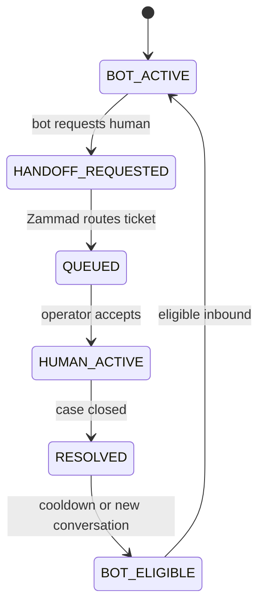

# M5-D-RC Customer Service Operations

**Date:** 2026-09-20

## Conversation lifecycle

| State | Owner | Description |
|-------|-------|-------------|
| BOT_ACTIVE | Yubie bot | Deterministic FSM handles routine menus |
| HANDOFF_REQUESTED | Yubie bot | Bot enqueued handoff + framing reply |
| QUEUED | Zammad routing | Ticket assigned to logical group |
| HUMAN_ACTIVE | Human operator | Operator owns conversation |
| RESOLVED | Human operator | Case considered complete |
| BOT_ELIGIBLE | Policy gate | New automation may resume under re-entry rules |

## Handoff destinations (logical)

| Destination | Zammad group | When |
|-------------|--------------|------|
| CUSTOMER_SUPPORT | Customer Support | Human request, complaint, general escalation |
| SALES_PARTNERSHIP | Sales / Partnership | B2B qualification complete |
| FOOD_SAFETY | Food Safety | Food safety / adverse reaction patterns |

Provider group IDs remain in deployment configuration (`ZAMMAD_GROUP_*`), not in `packages/assistant`.

## Bot re-entry policy

**Do not** automatically restart bot when Zammad ticket closes.

Baseline rules:

1. While `HUMAN_ACTIVE`: zero automated replies (enforced in pre-router + outbox delivery)
2. After human resolves: thread remains bot-ineligible until cooldown or clearly new conversation event
3. Reconcile worker syncs provider human state → local `conversation_sessions.state`

Implementation: [`apps/worker/src/reconcile-handler.ts`](../../../apps/worker/src/reconcile-handler.ts)

## Business hours

Handoff always created. Copy varies by `YUBIE_BUSINESS_HOURS_JSON`:

- **In hours:** "Baik, kami hubungkan ke Customer Service Yubie."
- **Out of hours:** "Pesanmu sudah diteruskan… jam operasional berikutnya."

Food Safety uses dedicated approved framing regardless of hours.

## Ticket metadata (bounded tags)

Examples applied at handoff:

- `bot:deterministic-v1`
- `channel:whatsapp`
- `intent:buy`, `intent:b2b`, `intent:complaint`
- `handoff:human-request`, `handoff:food-safety`
- `product:flour`

Never tag raw user text or PII.

## Operator checklist

1. Verify ticket landed in correct group (especially Food Safety)
2. Confirm high priority on food-safety tickets when configured
3. Do not expect bot replies while ticket is human-owned
4. Use Zammad tags for routing analytics, not customer content

## Emergency controls

- `POST /ops/assistant/emergency-off` — disable automation without redeploy
- See [assistant-emergency-off.md](../../production/runbooks/assistant-emergency-off.md)
