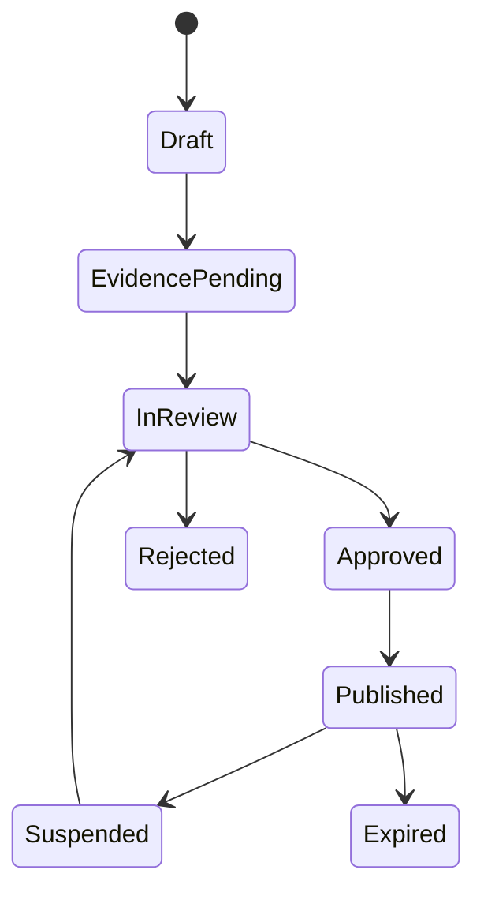

# 01 — Product Truth and Food Compliance

## 1. Purpose

Prevent the platform from selling or advertising a product using facts that are unapproved, expired, mismatched to the manufactured version, or operationally unsafe.

## 2. Product evidence pack

Each sellable SKU/variant requires a versioned evidence pack:

- legal product name and category;
- formula/specification version and ingredient list;
- allergen assessment and cross-contact statement;
- nutrition basis and laboratory/qualified calculation evidence;
- net content, serving basis, storage and preparation instructions;
- shelf-life/best-before basis and packaging specification;
- supplier and manufacturing records;
- final label artwork and digital product-page facts;
- applicable registration/permit records and validity;
- halal status and scope where applicable;
- approved claims with exact wording, channel, locale, evidence and expiry;
- approvers from product, food-safety/regulatory, and brand/commercial ownership.

Packaging mockups, AI-generated visuals, draft proposals, supplier marketing copy, and competitor labels are not authoritative evidence.

## 3. Claim lifecycle



Required fields: `claim_id`, exact text, language, claim type, product specification version, evidence references, jurisdictions/channels, owner, reviewers, approved/expiry dates, publication status, and supersession link.

The rendering layer resolves only `Published` claims whose product version, channel, locale, and effective dates match. Safe default is suppression.

## 4. Lot and release model

Each lot records SKU/spec version, internal lot code, manufacturer/supplier lots, production and release dates, best-before/expiry, quantity, storage condition, evidence/COA where applicable, release decision, quarantine/hold/recall state, and accountable approver.

Sellability invariant:

```text
released
AND not_quarantined
AND not_recalled
AND within_sellable_date_window
AND product_specification_is_active
AND required_product_evidence_is_approved
```

Inventory allocation uses FEFO (first-expiry-first-out) unless an approved operational exception is recorded.

## 5. Complaint and recall readiness

Food-safety triggers include suspected illness, allergen reaction, foreign object, contamination, packaging seal failure, incorrect label, abnormal smell/taste, infestation, or temperature/storage breach. These bypass normal support priority and enter the food-safety incident runbook.

Within a bounded investigation window, Yubie must identify:

- all inventory locations and quantities for an affected lot;
- related supplier/manufacturer and specification records;
- every order, shipment, customer, B2B sample and internal transfer;
- customer-contact status and returned/disposed quantity;
- public/private communication approvals and regulator contact evidence.

## 6. Indonesian regulatory watchpoints

- Packaged processed-food registration and label requirements must be verified through BPOM for the exact entity, product category, production model, and channel. Use the [BPOM registration portal](https://registrasipangan.pom.go.id/) and [BPOM legal database](https://jdih.pom.go.id/) as authoritative starting points.
- BPOM's UMK guidance notes that packaged processed food must follow applicable label requirements, including the framework under BPOM Regulation No. 31/2018 as subsequently amended/replaced; verify the current instrument before artwork approval via [BPOM's labeling guidance](https://istanaumkm.pom.go.id/blog/post/label-pangan-sesuai-aturan-panduan-untuk-umk-pangan-olahan).
- BPJPH currently communicates an expanded mandatory-halal milestone beginning **18 October 2026** for covered products including food and beverages in the relevant phase. Confirm Yubie's business classification, product scope, and certificate timing with BPJPH/qualified counsel using [current BPJPH guidance](https://bpjph.halal.go.id/read/wajib-halal-oktober-2026-momentum-pelaku-usaha-tingkatkan-daya-saing).
- Do not display BPOM, halal, nutrition, “high fibre,” meal-replacement, disease-risk, or similar regulated/health-adjacent statements until the exact wording and evidence are formally approved.

## 7. Publication gate

The product API returns a public projection, never the raw evidence store. CI checks cannot replace human regulatory approval, but can enforce structural rules: no public claim without approval metadata, no sellable SKU without active specification, and no available inventory without released lot.
