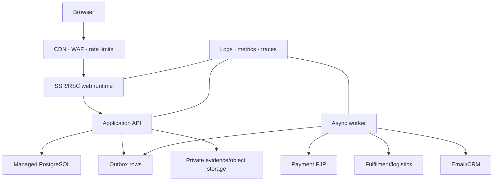

# 02 — Target System Architecture

## 1. Architectural style

Use a modular monolith with ports/adapters. It provides transactional correctness and low operational burden while preserving extraction seams.

Modules: identity/access, catalog/product truth, pricing, cart/checkout, orders, payments, inventory/lots, fulfilment, consent/communications, B2B/CRM, audit, and operator workflows.

## 2. Runtime topology

## 3. Synchronous path

Synchronous commands validate, authenticate/authorize, enforce invariants, commit canonical state and outbox records in one database transaction, then return a stable resource identifier. Do not wait for email, CRM, analytics, or nonessential fulfilment calls.

Payment-session creation may be synchronous but is isolated by timeout, idempotency, and a recoverable `payment_session_pending/failed` state.

## 4. Asynchronous path

- Transactional outbox prevents “database committed but message lost.”
- Webhook inbox stores raw provider event metadata and normalized payload references once before processing.
- Workers lease jobs, apply bounded exponential backoff with jitter, and move exhausted/poison events to dead-letter review.
- Handlers are idempotent and safe under duplicate delivery and out-of-order events.

## 5. Cache policy

Cache public catalog/editorial projections with explicit version/tag invalidation. Do not cache authorization decisions, cart mutations, payment truth, inventory reservations, lot release, consent changes, or operator commands as authoritative state.

## 6. Extraction criteria

Extract a module only when one or more are demonstrated:

- it requires materially different scaling or availability;
- failure isolation cannot be achieved within the monolith;
- a dedicated team needs independent deployment ownership;
- regulatory/security boundary justifies isolation;
- database contention or release coupling is measured and persistent.

Extraction requires an owned API/event contract, data migration plan, replay/reconciliation strategy, SLO, on-call/runbook, and cost model.
