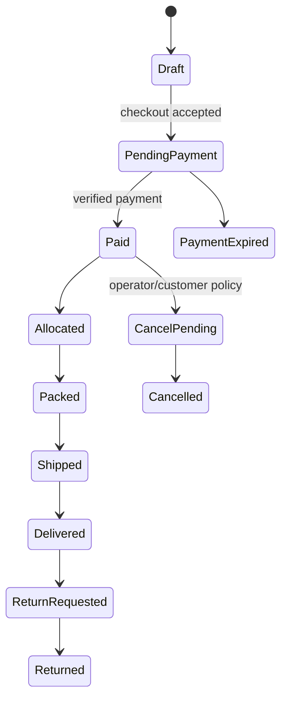

# 05 — Order, Payment, Inventory and Fulfilment

## 1. Order state machine

States are not arbitrary strings. Each transition defines actor, preconditions, idempotency key, inventory/financial side effects, audit event, notification, compensating action, and allowed next states.

## 2. Payment model

Separate order from payment. One order may have multiple payment attempts and at most the policy-allowed captured amount. Model intent, attempt, provider reference, method, amount/currency, status, verified events, settlement state, refund and reconciliation result.

Payment transitions account for created, customer-action-required, processing, succeeded, failed, expired, cancelled, partially/fully refunded, disputed/chargeback where supported. A late success after order expiry triggers reconciliation/exception handling rather than silently reopening fulfilment.

Use hosted payment components/pages from an appropriately authorized provider. Bank Indonesia's current framework requires payment-system services to be conducted by relevant authorized providers; confirm the selected provider through [BI licensing information](https://www.bi.go.id/id/fungsi-utama/sistem-pembayaran/perizinan/default.aspx) and current rules including [PBI No. 10/2025](https://www.bi.go.id/id/publikasi/peraturan/Pages/PBI_102025.aspx).

## 3. Inventory and lot allocation

Inventory movements: receive, release, quarantine, unquarantine, reserve, reservation-release, pick/consume, return-to-stock, damage, expiry, recall, correction. Corrections never erase history.

Reservation policy defines duration, payment-method extension, stock protection, concurrency control and release. Allocation is FEFO across released compatible lots. Inventory availability shown to customers includes safety buffer and excludes quarantined/recalled/expired lots.

## 4. Fulfilment

Packing requires order paid/approved, active reservation, specific lot allocation, valid packaging/label version, and address validation. Capture picker/packer, quantities, lots, timestamps, package and carrier references.

Carrier events are normalized but retained raw. Missing/stale tracking, address exception, damage, lost parcel and failed delivery create owned operator tasks.

## 5. Returns and refunds

Return/refund policy distinguishes change-of-mind, damaged package, wrong item, failed delivery, product quality, allergen/label issue, suspected illness, and recall. Food-safety categories escalate before normal disposition.

Refund creation is idempotent and approval-scoped, linked to original payment and order, and reconciled to provider settlement. Inventory is not automatically returned to sellable stock; food disposition requires inspection and policy.

## 6. Reconciliation

Daily automated reconciliation compares Yubie payment attempts/refunds with provider transactions and settlement reports. Exceptions include missing local/provider record, amount/currency mismatch, duplicate success, late success, unresolved processing, refund mismatch and settlement variance.

No exception older than the approved threshold remains unowned. Finance closes periods only after reconciliation evidence is retained.
