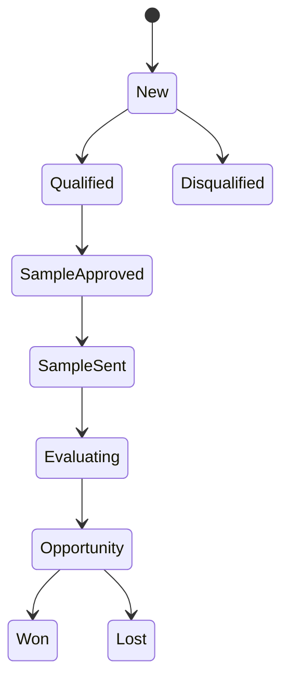

# 11 — B2B, CRM and Operator Operations

## 1. B2B lifecycle

Capture only necessary business/contact data, explicit communication preference, product interest, use case, expected volume/timeline, city, lead source, owner and next action. Free text is confidential and not copied into analytics.

## 2. Sample traceability

B2B samples are product distribution. Record SKU/specification, lot, quantity, recipient/business, address, dispatch/delivery, approval, intended evaluation and recall/contact status. Sample lots follow the same release/quarantine/recall rules as D2C inventory.

## 3. Operator surfaces

- Support: customer/order timeline, payment status, shipment, complaint and permitted refund action.
- Fulfilment: paid queue, reservation, FEFO lot allocation, packing, shipment and exceptions.
- Inventory/food safety: receipt, lot release, quarantine, expiry, recall and traceability.
- Finance: payment/refund/settlement reconciliation and exceptions.
- Product/regulatory: evidence, specification, claim/artwork approval and publication.
- B2B: lead stage, sample, activity, consent and next action.

No operator should need raw database access for normal work.

## 4. Audit and separation of duties

High-risk actions record actor, role, reason, before/after references, time, request/trace ID and approval where required. Marketing cannot self-approve protected claims; fulfilment cannot release quarantined stock; support cannot change settlement truth; engineers do not silently edit production orders.

## 5. Service levels

Define business-hour and urgent-safety response targets. Food-safety, privacy, security, payment-settlement and recall triggers override ordinary support queues and page the accountable incident path.
